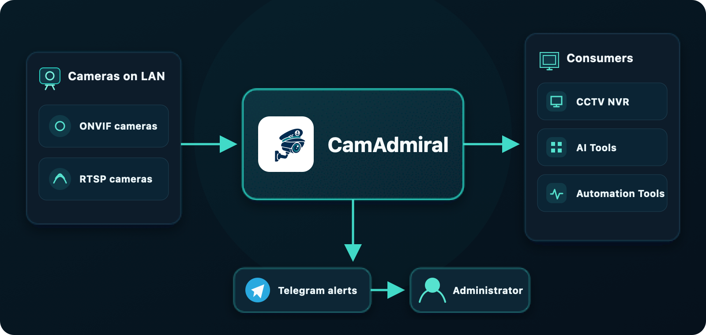
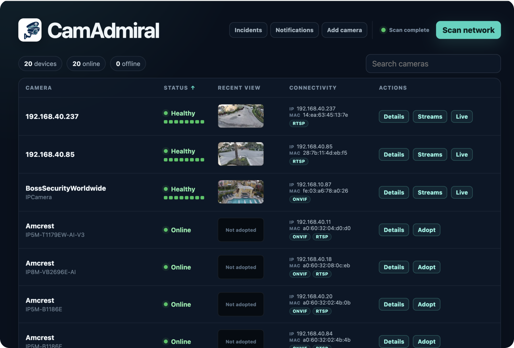
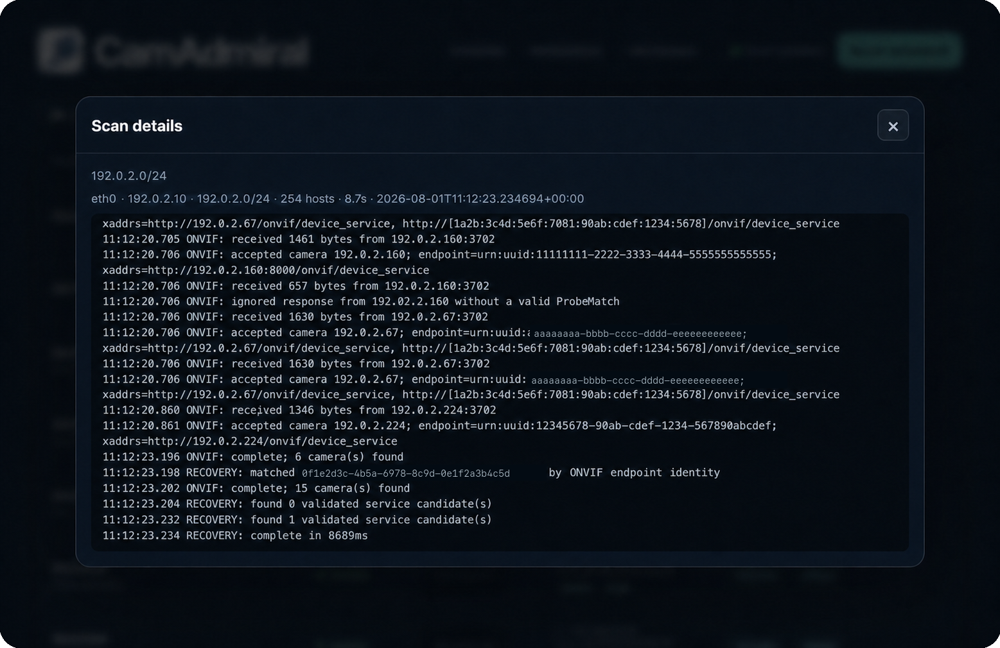
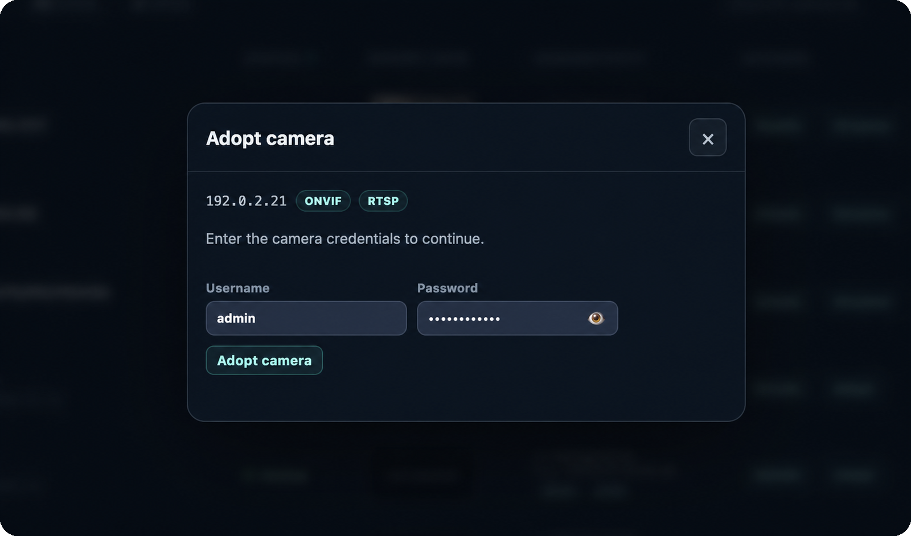
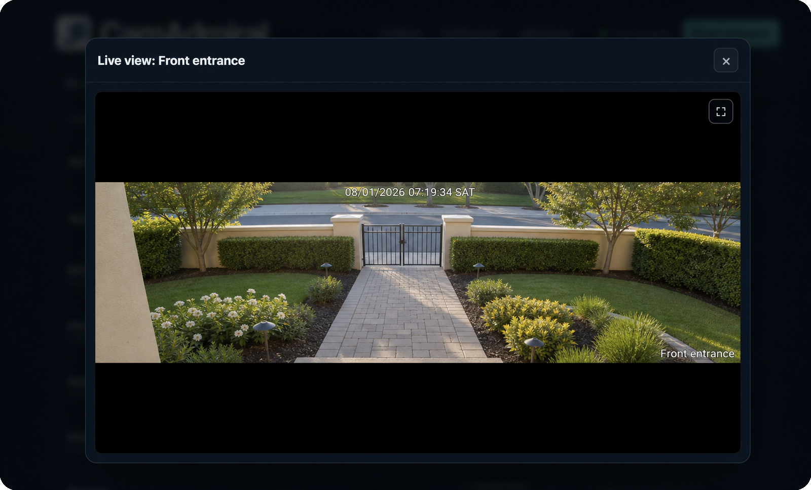
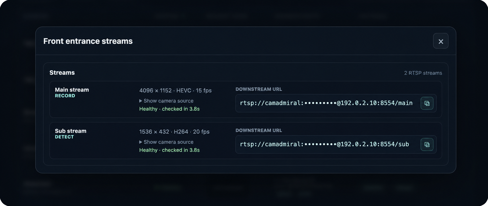
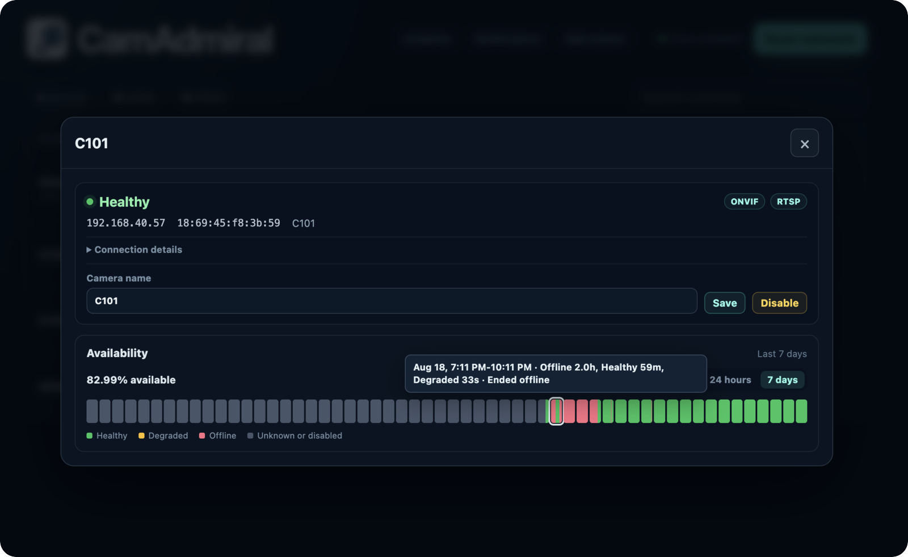
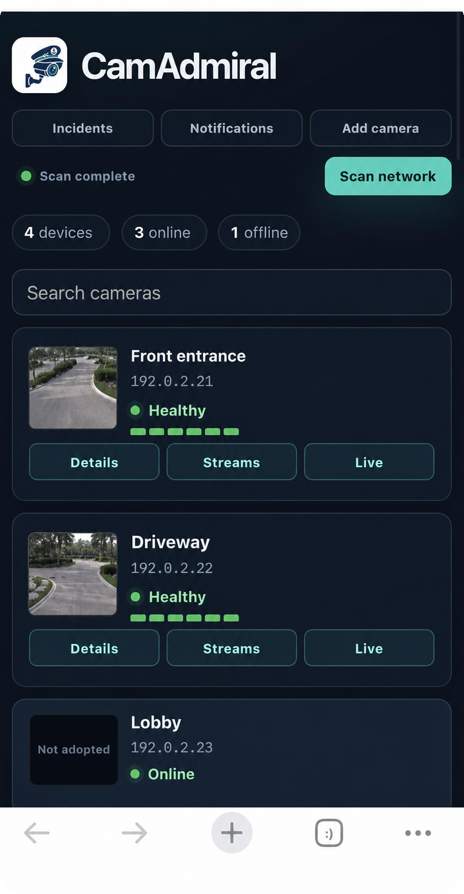
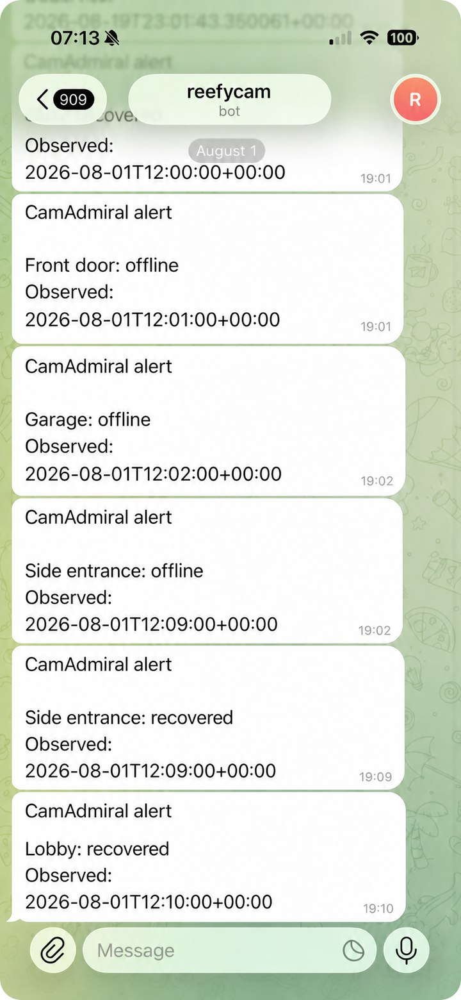

# CamAdmiral

CamAdmiral discovers ONVIF and RTSP cameras, validates their streams, and exposes stable
downstream streams for consumers such as Frigate.



## Why CamAdmiral?

- **Stable camera URLs.** Cameras on a local network can receive new IP addresses.
  CamAdmiral tracks adopted cameras by ONVIF identity or a unique MAC and keeps their downstream
  URLs stable, so consumers do not need reconfiguration after an IP change.
- **Shared camera connections.** CamAdmiral shares one upstream connection per camera
  stream across all consumers, reducing load on slow links such as Wi-Fi and on cameras
  with limited client capacity.
- **Health monitoring and alerts.** CamAdmiral monitors video availability, retains an
  availability history, and sends Telegram notifications when a camera goes offline or
  recovers.



## Discover and adopt cameras

CamAdmiral scans the local network for ONVIF and RTSP cameras. It includes an embedded,
independently maintained compatibility database of RTSP URL paths sourced from public
first-party vendor documentation. This lets CamAdmiral automatically try a bounded set of
likely stream paths after the operator supplies the camera username and password.

### How network discovery works

The **Scan network** dialog lists every connected private IPv4 LAN. An operator can exclude
detected subnets, add private routed CIDRs, and save that selection for future scans. Custom
CIDRs are limited to 1,024 usable hosts.

For directly connected networks, ONVIF discovery sends multicast WS-Discovery probes for
multiple dialects to `239.255.255.250:3702` and follows with bounded unicast probes. Multicast
is sent separately through each selected local interface. It normally cannot cross a router
or VLAN boundary, so custom routed CIDRs use unicast ONVIF probes only. RTSP discovery probes
ports `554` and `8554` and accepts only valid RTSP responses. The protocols and selected
subnets run concurrently and do not try camera credentials.

On LANs up to 1,024 hosts, unicast ONVIF and RTSP probes cover every address. Larger LANs
use ONVIF multicast plus addresses already learned in the host ARP table, avoiding an
unbounded sweep. Results are merged by IP and MAC. Adopted cameras are retained when absent,
marked offline, and recovered after IP changes using ONVIF identity or a unique MAC.

If automatic discovery misses a camera, **Add camera** accepts its IP address or complete
RTSP URL and probes only that address. The camera must be on a connected private LAN.
Timestamped protocol logs are available in the collapsed technical-log section of the scan
dialog. Per-subnet status shows which networks are queued, scanning, complete, or unavailable.



**Camera not detected?** If you identify the cause, please open a PR with the fix and a
regression test.

### Camera adoption

To make a camera managed by CamAdmiral, select **Adopt** and provide credentials for the
camera. CamAdmiral validates the credentials and streams before storing them. ONVIF cameras
provide their media profiles directly; RTSP-only cameras use the compatibility database or
an exact RTSP URL.

CamAdmiral does not change the camera configuration. It only reads camera capabilities and
consumes its media streams.



## Live view

Open a camera's live view directly from the dashboard to confirm its framing without leaving
CamAdmiral. The browser consumes CamAdmiral's managed downstream instead of opening another
connection to the camera.



## Stable downstream streams

CamAdmiral validates each source, reports its codec, resolution, frame rate, and health, then
exposes stable RTSP URLs for record and detection consumers. Camera credentials and source
paths remain hidden unless an operator explicitly reveals them. Downstream credentials in
the screenshot are intentionally masked.



### Camera identity and address changes

CamAdmiral treats an IP address as a camera location, not its identity. It matches an adopted
camera at a new address by its ONVIF EndpointReference first, with a unique MAC address as the
fallback for RTSP-only cameras. An ambiguous match is never applied automatically. If all stable
identities change, the old camera stays offline and the discovered device appears as a separate
camera that can be adopted.

Before accepting a move, CamAdmiral rediscovers the camera profiles and validates every selected
source. It keeps the existing stable stream names and URLs, records the new IP, MAC, and ONVIF
identity period, then restarts the bundled unmodified go2rtc relay. All downstream relay sessions
briefly disconnect and reconnect through the same URLs. This also handles compatible codec and
resolution changes without trying to modify go2rtc internals. Multiple camera moves found in one
recovery pass are applied with one relay restart.

The camera details view retains the dated identity history. Recovery opens an address-change
incident and resolves it only after the new streams are healthy. Any open offline or authentication
incident is also resolved after healthy media returns. Failed validation or relay recovery keeps
the last-known-good sources and leaves the address-change incident open for investigation.

## Latency

CamAdmiral relays RTSP video through go2rtc without transcoding. One additional relay hop
measured `0.04-0.17 ms` median and `0.21-0.47 ms` p95 on an uncongested Linux host,
consistent with go2rtc's [“zero-delay” design](https://github.com/AlexxIT/go2rtc/blob/v1.9.14/README.md#L14-L23).

## Availability timeline

Each camera includes a seven-day availability timeline. Red blocks show periods when the
camera was offline.



## Works on any device

CamAdmiral is a responsive web UI that works in a browser on laptops, tablets, and
phones. No separate mobile app is required.

<p align="center">
  
</p>

## Run with Docker

### Quick start

On a Linux system with Docker, run:

```console
./start-camadmiral.sh
```

The script pulls the latest image, creates the data volume, generates missing secrets, and
starts one hardened container. It never replaces existing secrets or persistent data. The
URL, admin credentials, and consumer API token are printed after startup. Secrets remain
inside the `camadmiral-data` volume.

Stop CamAdmiral without removing its container, credentials, or data:

```console
./stop-camadmiral.sh
```

Run `./start-camadmiral.sh` again to restart the preserved installation.

### Update

Update the repository checkout, then ask the launcher to pull the latest image and recreate
the container:

```console
git pull
./start-camadmiral.sh --update
```

You do not need to stop CamAdmiral first. The launcher pulls the replacement image before
stopping the existing container, then recreates only the container. Credentials,
configuration, adopted cameras, history, and other state remain in the `camadmiral-data`
volume. If the image pull fails, the existing container is left untouched.

### Build and run from source

To build the current source and start it through the same launcher:

```console
docker build -t camadmiral:local .
CAMADMIRAL_IMAGE=camadmiral:local ./start-camadmiral.sh
```

To replace an existing container with a newly rebuilt local image, add `--update`:

```console
docker build -t camadmiral:local .
CAMADMIRAL_IMAGE=camadmiral:local ./start-camadmiral.sh --update
```

No configuration file is required. On first boot, CamAdmiral generates its master key inside
the data volume. Recreating the container with the same named volume preserves adopted
cameras and credentials. The launcher is a plain shell script containing the complete
`docker volume` and `docker run` commands.

The browser prompts for the printed HTTP Basic credentials. Put CamAdmiral behind an HTTPS
reverse proxy before accessing it across an untrusted network because HTTP Basic credentials
are not encrypted by the application protocol.

The complete persistent state boundary is `/var/lib/camadmiral`. Back up and restore that
volume as a unit. Stop CamAdmiral before making a raw volume copy so the SQLite database and
its generated key are captured consistently.

CamAdmiral checks streams already in use from go2rtc's runtime counters and periodically asks
go2rtc for one small JPEG frame per camera. For an idle camera, that bounded request briefly
opens the source, validates decodable video, refreshes the in-memory table thumbnail, and
disconnects. An active camera reuses its existing upstream connection. Loading the web UI
reads only this cache and never opens a camera stream.

## Telegram notifications

Open **Settings > Notifications** in the web UI to connect a dedicated Telegram bot. Create the bot
with `@BotFather`, paste its token, then use the generated **Open Telegram** link and press
**Start**. CamAdmiral discovers the destination chat from that one-time pairing message, so
you do not need to find or enter a numeric chat ID. Alerts are enabled automatically when
the bot is configured and paired.

<p align="center">
  
</p>

Use a dedicated bot without an existing webhook. CamAdmiral rejects bots already connected
to another application and never changes their webhook configuration. The bot token and
temporary pairing secret are encrypted with CamAdmiral's master key and are never returned
by the settings API. Alert messages contain only the camera name, incident state, and
observation time. CamAdmiral also notifies the configured channel whenever its media relay
restarts, including a restart used to recover changed camera addresses. Messages do not contain
camera credentials, media URLs, IP addresses, or MAC addresses.

**Need another notification service?** Please open a PR with the provider.

## Frigate integration

Open **Settings > Integrations** and add the HTTP or HTTPS URL for each Frigate API. The URL
may use a loopback address, LAN address, DNS name, IPv6 address, or path-prefixed reverse
proxy. CamAdmiral validates the required configuration and runtime stream capabilities
before saving the integration. It then makes privileged configuration requests to that
endpoint, so connect only to a Frigate API you trust. Redirects are not followed.

Use **Choose cameras** on a Frigate integration to select the adopted cameras that instance
should receive through stable CamAdmiral downstream URLs. The chooser previews the Record and
Detect streams before synchronization. Each Frigate target has one CamAdmiral address mode:

- **LAN IP** is the default and uses the host's current default LAN address. CamAdmiral
  reconciles Frigate when DHCP changes that address.
- **Localhost** renders the hostname `localhost`. It is intended for a Frigate instance
  that shares the host network. CamAdmiral saves the operator's selection without probing
  or overriding it.

The address mode applies to every recording and detection stream synchronized to that Frigate
target. A camera's **Streams** dialog keeps a separate per-camera LAN or Localhost preference
for displaying and copying downstream URLs. Changing that display preference never changes a
Frigate target.

Use **Repair sync** from the Frigate target's actions menu to synchronize the selected cameras
and remove stale Frigate cameras and go2rtc streams in CamAdmiral's reserved `camadmiral_`
namespace. CamAdmiral shows one confirmation with the cleanup counts. Cameras and streams
outside that namespace are never removed or changed by sync repair.

Frigate integrations are operational settings stored in CamAdmiral's SQLite database.
They are included in the `/var/lib/camadmiral` backup boundary and are managed exclusively
through the web UI, not the YAML process configuration.

**Need another downstream consumer?** Please open a PR with the integration.

## Tests

Run the fast unit and component suite in an environment with the dependencies from
`requirements.txt`:

```console
python -m unittest discover -s tests -v
```

Real synthetic media workflows use the isolated Docker lab under `e2e/`:

```console
python3 e2e/run.py
```

The E2E runner builds the current container and verifies it only through HTTP, RTSP,
process, and persistent-volume boundaries. See [e2e/README.md](e2e/README.md) for its
scenario list and isolation guarantees.

The `CamAdmiral release gate` runs the fast suite for ordinary development commits. A
commit that changes `VERSION` is a release candidate and also runs the complete E2E lab.
Prepare the version metadata before the final validation commit, ideally by squashing it
with the completed feature work. Manual and reusable-workflow runs remain full gates.

The image publisher accepts only the exact versioned commit whose `Run isolated E2E lab`
step succeeded. A later development commit cannot be released by reusing an earlier gate.

CamAdmiral versions follow Reefy's `vYYYY.MM.DD-NN` convention. `VERSION` is the
standalone source version. On Reefy, the platform-injected `REEFY_APP_VERSION` is
authoritative and is displayed in the app footer.

## Optional configuration and external secrets

Mount [camadmiral.example.yaml](camadmiral.example.yaml) at
`/etc/camadmiral/config.yaml` to change the server, storage, or secret paths. An explicitly
configured `secrets.master_key_file` is authoritative and must
exist. This supports Docker Compose secrets and Reefy-managed read-only secret mounts. An
external master key is outside the data-volume backup boundary and must be backed up and
restored separately. The default generated key stays inside the data volume.
